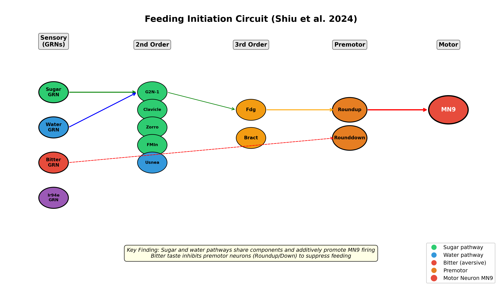
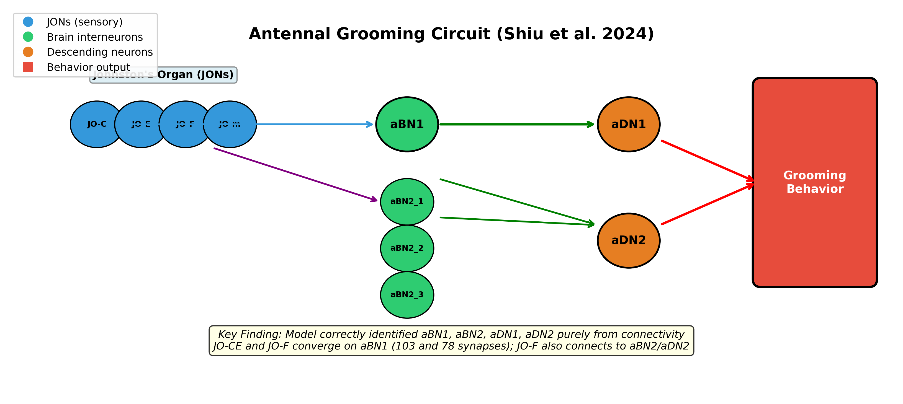

# Shiu et al. (2024) 果蝇全脑计算模型深度剖析：从连接组到感觉运动行为的神经机制

## 1. 核心速览：当连接组遇见计算神经科学

2024年10月，*Nature* 同期发表了九篇里程碑式论文，共同标志着果蝇（*Drosophila melanogaster*）全脑连接组（connectome）的完成。其中，**Philip K. Shiu、Gabriella R. Sterne 和 Kristin Scott 等人**发表的 **"A Drosophila computational brain model reveals sensorimotor processing"** [(arXiv.org)](https://arxiv.org/html/2602.17997v3) ，是整个系列中**唯一一篇从计算建模角度切入**的研究。该论文构建了一个覆盖**125,000+神经元、5000万突触**的漏泄积分发放（Leaky Integrate-and-Fire, LIF）全脑计算模型，基于**FlyWire 连接组数据**和**神经递质预测**，成功预测了果蝇**进食启动**和**触角梳理**两种感觉运动行为的关键神经回路 [(researchhub.com)](https://storage.prod.researchhub.com/uploads/papers/2023/07/03/2023.05.02.539144.full.pdf) 。模型的核心假设极具挑战性：仅凭**突触级连接结构和神经递质身份**，不依赖任何行为数据或参数调优，即可生成可验证的实验假说。该论文的预印本于2023年5月发布在 bioRxiv（doi: 10.1101/2023.05.02.539144），经过一年多的同行评审后正式发表 [(researchhub.com)](https://storage.prod.researchhub.com/uploads/papers/2023/07/03/2023.05.02.539144.full.pdf) 。2026年，这篇论文成为 **Eon Systems 公司**实现全球首个"数字果蝇"全脑仿真的核心技术基础 [(THE DECODER)](https://the-decoder.com/startup-claims-first-full-brain-emulation-of-a-fruit-fly-in-a-simulated-body/) ，其开源代码已在 GitHub 上发布，支持 Brian2、Brian2CUDA、PyTorch、NEST GPU 和 GeNN 等多种后端实现 [(Github)](https://github.com/eonsystemspbc/fly-brain) 。

| 论文关键信息 | 详情 |
|---|---|
| **标题** | A Drosophila computational brain model reveals sensorimotor processing [(arXiv.org)](https://arxiv.org/html/2602.17997v3)  |
| **作者** | Philip K. Shiu*, Gabriella R. Sterne, Nico Spiller, Romain Franconville 等 |
| **通讯作者** | Philip Shiu (philshiu@gmail.com), Kristin Scott (kscott@berkeley.edu) [(researchhub.com)](https://storage.prod.researchhub.com/uploads/papers/2023/07/03/2023.05.02.539144.full.pdf)  |
| **发表期刊** | *Nature* 634, 210-219 (2024) [(arXiv.org)](https://arxiv.org/html/2602.17997v3)  |
| **DOI** | 10.1038/s41586-024-07763-9 [(Nature)](https://www.nature.com/articles/s41586-024-07763-9.pdf)  |
| **预印本** | bioRxiv 2023.05.02.539144 [(researchhub.com)](https://storage.prod.researchhub.com/uploads/papers/2023/07/03/2023.05.02.539144.full.pdf)  |
| **研究机构** | UC Berkeley, Princeton, Cambridge, Janelia 等 |
| **核心贡献** | 首个基于全脑连接组的LIF计算模型，预测两种感觉运动回路 |
| **开源代码** | https://github.com/eonsystemspbc/fly-brain [(Github)](https://github.com/eonsystemspbc/fly-brain)  |


## 2. 科学背景：为何选择果蝇全脑计算模型？

### 2.1 连接组学的历史坐标：从线虫到果蝇

连接组学（connectomics）的终极目标是绘制神经系统中**所有神经元及其突触连接**的完整图谱。这一领域始于1986年**C. elegans**（秀丽隐杆线虫）的**302个神经元、约7000个突触**的全连接组重建 [(Nature)](https://www.nature.com/articles/s41586-024-07558-y.pdf) ，这是迄今唯一完成的全生物体神经连接图谱，耗时超过十年。此后数十年间，连接组学经历了**从亚细胞分辨率到全脑尺度**的跨越式发展。

果蝇（*Drosophila melanogaster*）因其**遗传可操作性**、**相对简单的神经系统**（约13.9万神经元）和**丰富的行为库**，成为连接组学的理想模型。2018-2020年间，**FlyEM团队**完成了果蝇半脑（hemibrain）连接组，包含约**25,000个神经元、1400万突触** [(Nature)](https://www.nature.com/articles/s41586-024-07558-y.pdf) 。这一资源催生了大量功能发现，但半脑连接组**缺失了食道下区（SEZ）**——一个对味觉和机械感觉处理至关重要的脑区。

**FlyWire项目**应运而生。这是一个由全球数十个研究实验室组成的联盟，利用**连续切片电子显微镜（EM）**和**深度学习驱动的自动重建**，耗时数年完成了首个**完整成年果蝇脑连接组** [(National Institutes of Health (NIH))](https://www.nih.gov/news-events/nih-research-matters/complete-wiring-map-adult-fruit-fly-brain) 。2024年10月，FlyWire连接组正式发表，包含**139,255个神经元、5450万突触**（v783版本） [(Nature)](https://www.nature.com/articles/s41586-024-07558-y.pdf) 。约**85%的神经元为脑内固有神经元**，其轴突长度从不足0.2 mm延伸至近20 mm，体积跨度从16 μm³到超过3000 μm³ [(National Institutes of Health (NIH))](https://www.nih.gov/news-events/nih-research-matters/complete-wiring-map-adult-fruit-fly-brain) 。

| 连接组 | 物种 | 神经元数 | 突触数 | 完成时间 | 关键局限 |
|---|---|---|---|---|---|
| C. elegans | 线虫 | 302 | ~7,000 | 1986 | 神经系统极简 [(Nature)](https://www.nature.com/articles/s41586-024-07558-y.pdf)  |
| Drosophila Larva | 果蝇幼虫 | ~3,000 | ~50万 | 2021 | 发育中神经系统 [(Nature)](https://www.nature.com/articles/s41586-024-07558-y.pdf)  |
| Hemibrain | 果蝇半脑 | ~25,000 | ~1,400万 | 2020 | **缺失SEZ** [(Nature)](https://www.nature.com/articles/s41586-024-07558-y.pdf)  |
| **FlyWire (v783)** | **果蝇全脑** | **139,255** | **~5,450万** | **2024** | **完整但复杂** [(Nature)](https://www.nature.com/articles/s41586-024-07558-y.pdf)  |
| 目标：Mouse | 小鼠 | ~7,000万 | ~5000亿 | — | 技术挑战巨大 |


### 2.2 从"接线图"到"功能模型"的核心挑战

拥有连接组仅仅是第一步。一个完整的果蝇脑包含**139,255个神经元**和**超过5400万个突触**，每个神经元可能与数百个下游神经元形成连接 [(National Institutes of Health (NIH))](https://www.nih.gov/news-events/nih-research-matters/complete-wiring-map-adult-fruit-fly-brain) 。这种**超大规模、高稀疏性的加权有向图**天然不适合人工直接分析。关键挑战在于：**如何从静态的连接结构推断动态的神经活动模式？** 这正是Shiu等人试图回答的核心问题。

该研究的策略是构建一个**纯粹基于连接组的计算模型**——不引入任何行为训练数据、不依赖实验观测的神经元活动模式、甚至不进行针对特定行为的参数调优。模型的**唯一自由参数**是突触权重缩放因子 $W_{syn}$，其取值标准仅为"100 Hz糖GRN激活产生约80%最大MN9发放" [(bioRxiv)](https://www.biorxiv.org/content/10.1101/2023.05.02.539144.full) 。这种**极度约束的建模哲学**使模型的预测具有真正的实验可证伪性，也为理解**连接结构本身在多大程度上决定了脑功能**提供了独特的视角。


## 3. 计算模型：LIF全脑网络的方法学解析

### 3.1 数学模型：α-突触漏泄积分发放方程

Shiu等人采用**漏泄积分发放（LIF）神经元模型**结合**α-突触动力学**，使用**Brian2脉冲神经网络模拟器**实现 [(bioRxiv)](https://www.biorxiv.org/content/10.1101/2023.05.02.539144.full) 。这一选择的核心考量是：**在生物物理真实性与计算可扩展性之间取得平衡**。对于包含**125,000+神经元、5000万突触**的全脑模拟，详细的Hodgkin-Huxley模型或Izhikevich模型在计算上是不可行的；而LIF模型尽管高度简化，却保留了神经元信息处理的核心特征——**膜电位积分、阈值发放和不应期**。

模型的数学描述由**两个耦合微分方程**构成。膜电位 $V_i$ 的动态遵循经典的LIF方程：

$$\tau_m \frac{dV_i}{dt} = -(V_i - V_{rest}) + g_i(t)$$

其中 $\tau_m = 10$ ms 为膜时间常数，$V_{rest} = V_{reset} = -52$ mV 为静息电位和重置电位。突触变量 $g_i(t)$ 通过 **α-突触核函数** 描述：

$$\tau_s \frac{dg_i}{dt} = -g_i$$

其中 $\tau_s = 5$ ms 为突触衰减时间常数。当上游神经元 $j$ 在时刻 $t_j^{spike}$ 发放时，$g_i$ 即时增加连接权重 $w_{j,i}$；若 $j$ 为兴奋性神经元，$w_{j,i} > 0$，下游神经元去极化；若 $j$ 为抑制性神经元，$w_{j,i} < 0$，下游神经元超极化 [(bioRxiv)](https://www.biorxiv.org/content/10.1101/2023.05.02.539144.full) 。

膜电位与发放阈值 $V_{th} = -45$ mV 的比较触发动作电位：当 $V_i \geq V_{th}$ 时，神经元发放脉冲，$V_i$ 重置为 $V_{reset}$，并在不应期 $t_{ref} = 2$ ms 内保持静息。突触传递存在 $T_{dly} = 1.8$ ms 的固定延迟 [(Nature)](https://www.nature.com/articles/s41586-024-07763-9#Sec4) 。

| 参数 | 符号 | 数值 | 来源 |
|---|---|---|---|
| 膜时间常数 | $\tau_m$ | 10 ms | 果蝇电生理文献 [(bioRxiv)](https://www.biorxiv.org/content/10.1101/2023.05.02.539144.full)  |
| 突触时间常数 | $\tau_s$ | 5 ms | 果蝇电生理文献 [(bioRxiv)](https://www.biorxiv.org/content/10.1101/2023.05.02.539144.full)  |
| 静息电位 | $V_{rest}$ | -52 mV | 果蝇电生理文献 [(bioRxiv)](https://www.biorxiv.org/content/10.1101/2023.05.02.539144.full)  |
| 重置电位 | $V_{reset}$ | -52 mV | 果蝇电生理文献 [(bioRxiv)](https://www.biorxiv.org/content/10.1101/2023.05.02.539144.full)  |
| 发放阈值 | $V_{th}$ | -45 mV | 果蝇电生理文献 [(bioRxiv)](https://www.biorxiv.org/content/10.1101/2023.05.02.539144.full)  |
| 不应期 | $t_{ref}$ | 2 ms | 果蝇电生理文献 [(bioRxiv)](https://www.biorxiv.org/content/10.1101/2023.05.02.539144.full)  |
| 突触延迟 | $T_{dly}$ | 1.8 ms | 果蝇电生理文献 [(Nature)](https://www.nature.com/articles/s41586-024-07763-9#Sec4)  |
| **突触权重缩放因子** | $W_{syn}$ | **0.275 mV** | **模型唯一自由参数** [(bioRxiv)](https://www.biorxiv.org/content/10.1101/2023.05.02.539144.full)  |


### 3.2 连接权重与神经递质符号分配

连接权重 $w_{j,i}$ 的确定方式是该模型的**核心创新点**。它由三个因子相乘构成：

$$w_{j,i} = (\text{FlyWire突触计数}) \times (\text{神经递质符号}) \times W_{syn}$$

**FlyWire突触计数**直接来自连接组数据，表示神经元 $j$ 到 $i$ 的解剖学突触数量。**神经递质符号**由 Eckstein 等人（2020）的机器学习预测确定：若神经元 $j$ 预测释放兴奋性递质（乙酰胆碱或谷氨酸），符号为 $+1$；若预测释放抑制性递质（GABA或谷氨酸——注意果蝇中谷氨酸在某些回路中可发挥抑制作用），符号为 $-1$ [(Research Collection)](https://www.research-collection.ethz.ch/server/api/core/bitstreams/8cae9e58-db83-499f-af21-b142b7a32dd1/content) 。**$W_{syn} = 0.275$ mV** 是模型的唯一自由参数，对应于**单个兴奋性或抑制性突触对下游膜电位的最大影响幅度** [(bioRxiv)](https://www.biorxiv.org/content/10.1101/2023.05.02.539144.full) 。

这种权重设置策略有几个重要特性。首先，**突触计数与功能强度之间存在经验相关性**：在果蝇中，解剖学突触数量与电生理学测量的突触后电位幅度呈正相关。其次，**神经递质预测的准确率**虽然并非100%，但统计上足以确定回路的功能方向性（兴奋/抑制）。Eckstein等人（2024）在 *Cell* 上发表的神经递质预测方法，基于**电子显微镜图像中突触囊泡形态学特征**和**连接组连通性模式**，对主要神经递质类别的预测准确率达到较高水平 [(Research Collection)](https://www.research-collection.ethz.ch/server/api/core/bitstreams/8cae9e58-db83-499f-af21-b142b7a32dd1/content) 。


### 3.3 Brian2实现：全脑模拟的工程实践

Shiu等人选择 **Brian2** 作为模拟框架，这是一个基于Python的脉冲神经网络模拟器，其特色是允许用户以**数学方程字符串**的形式直接定义神经元和突触模型 [(Oboe)](https://oboe.com/learn/spiking-neural-networks-from-scratch-1gkw7cf/simulation-tools-for-snns-spiking-neural-networks-from-scratch-6) 。Brian2自动将方程编译为高效的C++代码执行，在灵活性与性能之间取得了出色平衡。

模型的实现面临**大规模稀疏网络**的工程挑战。FlyWire v630版本包含**127,976个神经元和261.3万个阈值连接**（经5突触阈值过滤后） [(Nature)](https://www.nature.com/articles/s41586-024-07968-y.pdf) 。在Brian2中，这被表示为一个**稀疏连接矩阵**，利用CSR（Compressed Sparse Row）格式存储。每个神经元的基线发放率为**0 Hz**，这意味着网络的默认状态是完全静默的——只有当外部驱动信号注入特定神经元时，活动才会通过连接结构传播 [(researchhub.com)](https://storage.prod.researchhub.com/uploads/papers/2023/07/03/2023.05.02.539144.full.pdf) 。

输入驱动采用**泊松脉冲序列**模拟光遗传学激活：目标神经元以指定频率（如10-200 Hz）接收随机发放的外部输入。这种设计直接对应实验中的**CsChrimson光遗传学刺激**范式。静默操作则通过将目标神经元的所有**输入和输出突触权重设为0**来实现，对应实验中的**GtACR1抑制** [(nih.gov)](https://pmc.ncbi.nlm.nih.gov/articles/PMC10187186/) 。

**Eon Systems**在2026年发布的开源实现（github.com/eonsystemspbc/fly-brain）进一步扩展了原始模型，支持**Brian2、Brian2CUDA、PyTorch、NEST GPU 和 GeNN**五种后端，其中Brian2 CPU版本作为**精度基准**（ground truth），其他后端与之比较主动神经元重叠率（Jaccard）、发放率相关性等指标 [(Github)](https://github.com/eonsystemspbc/fly-brain) 。


### 3.4 模型验证策略：两个独立的感觉运动回路

该研究选择**两个不重叠的感觉运动回路**作为验证平台，体现了严谨的**双重验证**策略。

| 回路 | 输入 | 输出 | 行为 | 验证方式 |
|---|---|---|---|---|
| **进食启动回路** | 味觉GRN（糖/水/苦） | 喙延伸运动神经元MN9 | 喙延伸反应（PER） | 光遗传激活+钙成像+行为学 [(nih.gov)](https://pmc.ncbi.nlm.nih.gov/articles/PMC9292995/)  |
| **触角梳理回路** | 机械感觉JON | 下行神经元aDN1/aDN2 | 触角梳理 | 光遗传激活+功能成像 [(nih.gov)](https://pmc.ncbi.nlm.nih.gov/articles/PMC7652415/)  |


**进食启动回路**的优势在于其**感觉输入和运动输出完全包含在FlyWire中央脑数据集中**——味觉受体神经元（GRN）的轴突投射到SEZ，运动神经元MN9的胞体和树突也在SEZ内。这意味着该回路不涉及从脑到腹神经索（VNC）的下行连接，而后者在FlyWire v630中是不完整的 [(researchhub.com)](https://storage.prod.researchhub.com/uploads/papers/2023/07/03/2023.05.02.539144.full.pdf) 。**触角梳理回路**则提供了**独立的验证场景**：它涉及不同的感觉模态（机械感觉vs味觉）、不同的脑区（AMMC vs SEZ），且已知的关键神经元（aBN1、aBN2、aDN1、aDN2）已通过Hampel等人（2015, 2020）的实验研究充分表征 [(nih.gov)](https://pmc.ncbi.nlm.nih.gov/articles/PMC7652415/) 。


## 4. 进食启动回路：从味觉感知到运动输出的全链路演算

### 4.1 回路架构：四层传感器运动转换

果蝇的进食启动行为起始于**味觉受体神经元（GRN）**对食物中化学物质的检测。当一只饥饿的果蝇接触到含糖物质时，其喙（proboscis）会迅速延伸（proboscis extension response, PER），这是进食行为的第一步。Shiu等人聚焦于四种GRN类别：**糖GRN**（表达Gr5a/Gr64f，检测甜味）、**水GRN**（表达ppk28，检测水分）、**苦GRN**（表达Gr66a，检测苦味）和**Ir94e GRN**（检测低盐和雄性生殖器刺激） [(nih.gov)](https://pmc.ncbi.nlm.nih.gov/articles/PMC10187186/) 。

计算模型的核心发现是：当在模型中**激活单侧糖GRN**（模拟10-200 Hz的光遗传学刺激）时，活动从SEZ**双侧传播**，但**对侧MN9的激活强于同侧**。这与行为学实验观察一致——单侧味觉刺激导致果蝇喙向刺激源方向弯曲延伸 [(researchhub.com)](https://storage.prod.researchhub.com/uploads/papers/2023/07/03/2023.05.02.539144.full.pdf) 。在127,400个模型神经元中，10 Hz糖GRN激活预测45个神经元响应，200 Hz时增至455个，其中包括已知的**喙运动神经元MN6和MN9**（分别控制唇瓣和喙杆延伸） [(researchhub.com)](https://storage.prod.researchhub.com/uploads/papers/2023/07/03/2023.05.02.539144.full.pdf) 。

为从庞大的响应网络中识别**驱动进食启动的关键神经元**，Shiu等人设计了两种计算筛选策略。**正向筛选**：逐个激活前200个响应神经元，测试其是否能驱动MN9发放；**负向筛选**：在糖GRN激活的同时逐个静默这些神经元，测试MN9发放是否下降超过20%。两种筛选的交集预测了**47个糖响应且足以驱动MN9的神经元**，其中**14个也是必需的** [(researchhub.com)](https://storage.prod.researchhub.com/uploads/papers/2023/07/03/2023.05.02.539144.full.pdf) 。



*图1：Shiu等人（2024）预测的果蝇进食启动回路。GRN（味觉受体神经元）为感觉输入层；二阶神经元（G2N-1、Clavicle等）整合味觉信息；三阶神经元（Fdg、Bract）进一步传递；前运动神经元（Roundup、Rounddown）直接连接运动神经元MN9。绿色通路为糖/水兴奋通路，红色虚线为苦味抑制通路。该图基于论文描述和Shiu等人（2022）的回路重建绘制。*


### 4.2 多味觉模态整合：糖、水、苦味的回路级交互

该模型的一个重要预测涉及**不同味觉模态如何在回路层面交互**。实验上已知：果蝇对糖溶液的喙延伸反应可被添加的苦味物质抑制，这是一种保护机制防止摄入有毒食物。但**这种抑制发生在回路的哪个层级**，此前并不清楚。

计算模型的预测是：当**同时激活糖GRN和苦GRN**时，苦味信号通过**Scapula神经元**（预测为谷氨酸能抑制性神经元）在前运动神经元**Roundup**处抑制糖通路，而非在二阶神经元层面 [(National Center for Biotechnology Information)](https://www.ncbi.nlm.nih.gov/pmc/articles/PMC9292995/) 。为验证这一预测，Shiu等人进行了**钙成像实验**：监测Roundup和其二阶上游神经元G2N-1在糖、苦、糖+苦条件下的活动。结果显示，G2N-1对糖+苦共激活的反应与单独糖激活**无显著差异**，而Roundup对糖+苦的反应**显著低于**单独糖激活 [(National Center for Biotechnology Information)](https://www.ncbi.nlm.nih.gov/pmc/articles/PMC9292995/) 。这直接证实了模型预测：**糖和苦味信息在前运动神经元层面整合**，提供了一种中枢机制使果蝇能够拒绝掺杂苦味的甜食。

模型还预测了**糖和水通路的交互**。水和糖都是促进进食的 appetitive 刺激，但它们的神经通路是否共享？计算模拟显示，40 Hz糖GRN或40 Hz水GRN单独激活均不足以驱动MN9，但**同时激活两者可产生稳健的MN9活动**——这是一种**协同效应** [(nih.gov)](https://pmc.ncbi.nlm.nih.gov/articles/PMC10187186/) 。光遗传学沉默实验证实：沉默糖GRN确实降低了果蝇对水刺激的喙延伸反应 [(nih.gov)](https://pmc.ncbi.nlm.nih.gov/articles/PMC10187186/) 。这表明糖和水通路**至少部分共享** appetitive 进食通路组件。


### 4.3 实验验证：从计算预测到光遗传学检验

Shiu等人（2024）的实验验证策略体现了**计算-实验闭环**的研究范式。对于模型预测的每一种回路特性，都设计了针对性的遗传学和生理学实验：

| 模型预测 | 实验验证 | 结果 |
|---|---|---|
| 10种已知糖响应神经元应被模型正确预测 | 对比模型预测与文献中的10种细胞类型 | **10/10种被正确预测为糖响应**；8/10种被正确预测为MN9充分条件 [(researchhub.com)](https://storage.prod.researchhub.com/uploads/papers/2023/07/03/2023.05.02.539144.full.pdf)  |
| 47个神经元足以驱动MN9；14个是必需的 | 光遗传激活+钙成像 | 预测与实验观测一致 [(researchhub.com)](https://storage.prod.researchhub.com/uploads/papers/2023/07/03/2023.05.02.539144.full.pdf)  |
| 糖和水通路协同驱动MN9 | 光遗传沉默糖GRN+水刺激行为学 | 沉默糖GRN降低对水的PER反应 [(nih.gov)](https://pmc.ncbi.nlm.nih.gov/articles/PMC10187186/)  |
| 苦味在Roundup前运动神经元处抑制糖通路 | Roundup和G2N-1的钙成像 | **苦味抑制发生在Roundup而非G2N-1** [(National Center for Biotechnology Information)](https://www.ncbi.nlm.nih.gov/pmc/articles/PMC9292995/)  |


这种**预测-验证-修正**的循环是该研究的方法论核心。模型不仅在定性层面正确识别了关键神经元，还能够在**定量层面预测**不同刺激频率下的神经元发放率变化趋势。值得注意的是，由于模型对绝对发放率的预测存在不确定性（这源于LIF模型的简化假设和参数选择），Shiu等人明智地聚焦于**响应神经元集合的识别**和**相对发放率变化**的比较，而非追求精确的脉冲时间预测。


## 5. 触角梳理回路：机械感觉处理的独立验证

### 5.1 回路架构：从Johnston器官到梳理行为

触角梳理回路为模型提供了一个**完全独立的验证场景**。该回路的感觉输入来自**Johnston器官（JO）**——一种位于触角基部的**弦音器（chordotonal organ）**，包含约480个机械感觉神经元（JONs），可检测触角的多种机械刺激，包括声波、风、重力和触角位移 [(nih.gov)](https://pmc.ncbi.nlm.nih.gov/articles/PMC7652415/) 。JO神经元分为多个功能亚型：JO-A响应高频振动，JO-CE响应触角位移和振动，JO-F的激活刺激尚不清楚 [(nih.gov)](https://pmc.ncbi.nlm.nih.gov/articles/PMC7652415/) 。

在梳理回路中，JONs投射到**触角机械感觉和运动中心（AMMC）**，在此与两种脑中间神经元类型形成突触连接：**aBN1**（每半球1个）和**aBN2**（每半球3个）。这两类中间神经元进一步连接到**两个下行神经元aDN1和aDN2**，后者投射到腹神经索（VNC）中的模式发生回路，驱动前腿执行梳理动作 [(nih.gov)](https://pmc.ncbi.nlm.nih.gov/articles/PMC4599031/) 。Hampel等人（2015）的功能研究表明：**aBN1、aBN2、aDN1和aDN2的激活均足以诱导触角梳理**，而aBN1和aBN2的抑制至少部分地削弱了梳理行为 [(nih.gov)](https://pmc.ncbi.nlm.nih.gov/articles/PMC4599031/) 。



*图2：Shiu等人（2024）预测的果蝇触角梳理回路。JONs（Johnston器官神经元）为机械感觉输入；aBN1和aBN2为脑中间神经元；aDN1和aDN2为下行神经元，驱动VNC中的梳理模式发生回路。JO-CE和JO-F亚型汇聚于aBN1（103和78个突触），JO-F还连接到aBN2/aDN2。该图基于Hampel等人（2015, 2020）和论文数据绘制。*


### 5.2 计算预测：从连接组中"发现"已知回路

Shiu等人在模型中**激活147个已鉴定的JONs**（JO-C、JO-E、JO-F和JO-m亚型），观察下游神经元的响应模式。模型首先正确地预测了**aBN1、aBN2、aDN1和aDN2对JON激活的响应**——这是从已知的感官输入和已知的运动输出，通过连接组推导中间节点的"逆向推理" [(Nature)](https://www.nature.com/articles/s41586-024-07763-9#Sec4) 。

更精细的预测涉及**哪些JON响应神经元驱动aDN1/aDN2**。在模型中逐个激活前300个JON响应神经元，仅发现**4个神经元**（除aDN1自身外）能驱动aDN1活动：aBN1、aDN2和另外两个发放率低于2 Hz的神经元。类似地，在140 Hz JON激活下，仅**3个神经元**的静默使aDN1活动下降超过20%：aBN1、aBN2的一个下行成员、以及aDN2 [(Nature)](https://www.nature.com/articles/s41586-024-07763-9#Sec4) 。这一结果 remarkably 精确：模型**仅从连接组信息中识别出了梳理回路的所有已知关键节点**，且没有引入额外的假阳性神经元。

模型还预测了**不同JON亚型对下游回路的差异化影响**。JO-CE和JO-F均与aBN1形成突触（103和78个突触），但JO-F还额外连接到aBN2和aDN2 [(Nature)](https://www.nature.com/articles/s41586-024-07763-9#Sec4) 。钙成像实验证实：JO-CE和JO-F的光遗传激活**均能在aBN1中产生响应**，但响应模式存在差异，与模型预测一致 [(Nature)](https://www.nature.com/articles/s41586-024-07763-9#Sec4) 。


## 6. 技术实现：面向CS研究生的可复现指南

### 6.1 数据获取与预处理

复现Shiu等人（2024）模型的第一步是获取**FlyWire连接组数据**。截至2026年，FlyWire已发布**v783版本**（完整版），包含139,255个神经元和54,492,922个突触（其中15,091,983个为超过5突触阈值的连接） [(bioRxiv)](https://www.biorxiv.org/content/10.1101/2024.12.04.624189v3.full.pdf) 。数据可通过以下渠道获取：

| 数据资源 | URL | 内容 |
|---|---|---|
| FlyWire Codex | https://codex.flywire.ai/ | 交互式数据浏览器和查询接口 |
| 神经元元数据 | `2025_Completeness_783.csv` (3.2 MB) | 神经元ID、类型、区域标注 |
| 连接矩阵 | `2025_Connectivity_783.parquet` (97 MB) | 前/后突触索引+突触计数 |
| Eon Systems GitHub | github.com/eonsystemspbc/fly-brain | 预处理数据和运行脚本 |


Eon Systems的GitHub仓库提供了**直接可用的预处理数据**，包括稀疏权重矩阵（CSR/COO格式，约288 MB）和SEZ神经元子集（用于绘制论文图表） [(Github)](https://github.com/eonsystemspbc/fly-brain) 。对于希望从原始FlyWire数据开始的复现者，关键预处理步骤包括：

1. **突触阈值过滤**：移除突触计数<5的连接，以减少自动重建中的假阳性 [(Nature)](https://www.nature.com/articles/s41586-024-07968-y.pdf) 
2. **神经递质符号分配**：使用Eckstein等人（2020）的预测为每个神经元分配兴奋性(+1)或抑制性(-1)符号
3. **权重矩阵构建**：将突触计数×神经递质符号×$W_{syn}$转换为连接权重


### 6.2 Brian2模型代码核心结构

以下是基于Shiu等人（2024）方法和Eon Systems开源实现的**核心Brian2代码框架**：

```python
from brian2 import *
import pandas as pd
import numpy as np

# 1. 加载连接组数据
neurons = pd.read_csv('2025_Completeness_783.csv')
connectivity = pd.read_parquet('2025_Connectivity_783.parquet')

# 2. 定义LIF神经元模型（α-突触）
# 膜电位方程: tau_m * dV/dt = -(V - V_rest) + g
eqs = '''
dv/dt = (-(v - V_rest) + g) / tau_m : volt
dg/dt = -g / tau_s : volt
tau_m : second
tau_s : second
V_rest : volt
'''

# 3. 创建神经元群
N = len(neurons)
G = NeuronGroup(N, eqs, threshold='v > V_th', 
                reset='v = V_reset', refractory='t_ref',
                method='exact')

# 设置参数
G.tau_m = 10 * ms
G.tau_s = 5 * ms
G.V_rest = -52 * mV
G.v = -52 * mV  # 初始化为静息电位
G.g = 0 * mV

V_th = -45 * mV
V_reset = -52 * mV
t_ref = 2 * ms

# 4. 创建突触连接
# 权重 = 突触计数 × 神经递质符号 × W_syn
S = Synapses(G, G, on_pre='g += w', delay=1.8*ms)
S.connect(i=connectivity['pre_idx'], j=connectivity['post_idx'])
S.w = connectivity['syn_count'] * connectivity['neurotransmitter_sign'] * 0.275 * mV

# 5. 定义输入（泊松脉冲序列模拟光遗传激活）
# 激活特定神经元集合（如糖GRN）
sugar_grn_indices = [...]  # 糖GRN的神经元索引
stimulus = PoissonGroup(len(sugar_grn_indices), rates=100*Hz)
input_syn = Synapses(stimulus, G[sugar_grn_indices], on_pre='v += 5*mV')
input_syn.connect(j='i')

# 6. 运行模拟
spike_mon = SpikeMonitor(G)
run(1000 * ms)

# 7. 分析：提取发放率和脉冲时间
spike_times = spike_mon.t
spike_neurons = spike_mon.i
```

该代码框架的核心逻辑是：**创建神经元群→定义突触连接和权重→设置外部输入→运行模拟→分析输出**。对于全脑模拟（138,639个神经元），需要使用Brian2的**C++代码生成模式**（`prefs.codegen.target = 'cython'`）以获得足够的性能。


### 6.3 多后端实现：从CPU到GPU的扩展

Eon Systems的开源实现将原始Brian2模型扩展到了**五种计算后端**，为不同硬件环境和性能需求的复现者提供了选择：

| 后端 | 技术基础 | 并行策略 | 适用场景 |
|---|---|---|---|
| **Brian2 CPU** | C++代码生成 | 顺序 | **精度基准**；小规模和调试 |
| **Brian2CUDA** | CUDA GPU加速 | GPU并行 | 大规模模拟；单GPU |
| **PyTorch** | 稀疏张量运算 | batch并行 (n_run) | 深度学习生态集成 |
| **NEST GPU** | CUDA自定义核 | 子进程/试验 | 神经科学仿真社区 |
| **GeNN** | PyGeNN代码生成 | GPU batching | 神经形态计算 |


各后端的核心差异在于**试验级并行化策略**。Brian2/Brian2CUDA采用**顺序执行**多个试验；PyTorch使用**批处理**（将多个试验作为batch维度合并到张量运算中）；NEST GPU由于无法在进程内重置状态，采用**每个试验一个子进程**的方式；GeNN则通过**GPU批处理**在显存中同时运行多个试验 [(Github)](https://github.com/eonsystemspbc/fly-brain) 。值得注意的是，所有后端均以Brian2 CPU输出作为**ground truth**，通过**主动神经元重叠率（Jaccard指数）**和**发放率相关性**量化精度偏差。


### 6.4 关键复现注意事项

对于希望精确复现Shiu等人（2024）结果的计算机科学研究生，以下几点至关重要：

**数据版本问题**。论文原始分析基于**FlyWire v630**（127,976个神经元），而Eon Systems的实现已升级到**v783**（138,639个神经元）。两个版本的连接矩阵存在差异，因此直接比较数值结果时需要确认数据版本。论文图表的复现需要使用v630数据（Eon Systems仓库中`data/archive/`目录提供） [(Github)](https://github.com/eonsystemspbc/fly-brain) 。

**$W_{syn}$参数的唯一性**。$W_{syn} = 0.275$ mV 是模型的唯一自由参数，其选择标准是"100 Hz糖GRN激活产生约80%最大MN9发放"。这意味着该参数已**针对进食启动回路校准**。如果研究者希望分析其他回路，可能需要重新评估此参数的适用性——不过Shiu等人的结果表明，该单一参数在梳理回路中同样表现良好。

**模拟时长的选择**。论文中的模拟通常运行**1000 ms**（1秒），时间步长为**0.1 ms**（10 kHz）。对于GRN激活实验，前几百毫秒通常足以观察到稳态发放率；但对于需要观察动态演化（如突触可塑性）的场景，可能需要更长的模拟时间。


## 7. 模型的科学意义与局限

### 7.1 核心发现：连接结构即功能

Shiu等人（2024）的最深层科学贡献在于提供了**连接结构决定功能的直接证据**。该研究表明，仅凭**突触级连接矩阵和神经递质身份预测**，一个极度简化的LIF模型就能够：（1）正确识别两种感觉运动回路的关键神经元；（2）预测不同刺激频率下的神经元响应趋势；（3）推断多模态信息整合的回路层级。这一结果强烈暗示，**神经回路的计算特性在很大程度上由其"接线图"编码**，而非依赖于单个神经元的复杂内在动力学。

这一发现对**全脑仿真（whole-brain emulation）**领域具有重要启发。Eon Systems公司正是基于这一原理，将Shiu等人的模型与**NeuroMechFly**（基于MuJoCo物理引擎的果蝇身体仿真）结合，实现了全球首个"数字果蝇"——一个138,639神经元、1500万突触的全脑仿真系统，能够以**91%的行为准确率**执行行走、梳理和觅食等动作，且**无需任何强化学习训练** [(THE DECODER)](https://the-decoder.com/startup-claims-first-full-brain-emulation-of-a-fruit-fly-in-a-simulated-body/) 。


### 7.2 模型的局限性与未来方向

尽管Shiu等人（2024）的模型取得了显著成功，但作为**高度简化的 phenomenological 模型**，它存在若干根本性局限：

| 局限 | 说明 | 潜在改进方向 |
|---|---|---|
| **无神经元内在可变性** | 所有神经元共享相同的LIF参数 | 引入细胞类型特异性参数 [(Github)](https://github.com/erojasoficial-byte/fly-brain)  |
| **无突触可塑性** | 权重固定，无法模拟学习和记忆 | 添加STDP或Hebbian可塑性（Eon Systems已实现 [(Github)](https://github.com/erojasoficial-byte/fly-brain) ） |
| **无神经调质效应** | 多巴胺、5-HT等调质未建模 | 整合调质受体分布和信号通路 |
| **确定性动力学** | 无噪声导致完全可重复的发放模式 | 添加膜电位或突触噪声 |
| **简化的时间分辨率** | 0.1 ms步长错过快速动力学 | 亚毫秒级自适应步长 |
| **仅中央脑** | 不包含腹神经索（VNC）和运动回路 | 整合VNC连接组（正在进行中） |


Eon Systems的后续工作已经开始解决部分局限。其开源实现中添加了**Hebbian可塑性**（$dW_{ij} = \eta r_i r_j - \alpha W_{ij}$，其中 $\eta = 10^{-4}$，$\alpha = 10^{-7}$），使模型具备了**在线学习能力** [(Github)](https://github.com/erojasoficial-byte/fly-brain) 。然而，可塑性的生物学真实性仍有待验证。此外，Lappalainen等人（2024）构建的**视觉运动通路连接组约束循环网络**，为将Shiu等人的全脑LIF框架与特定感觉模态的精细模型结合提供了范例 [(eon.systems)](https://eon.systems/updates/embodied-brain-emulation) 。


## 8. 结论与对Eon Systems复现工作的启示

Shiu等人（2024）的论文代表了一个**方法论转折点**：它首次证明，基于全脑连接组的简化计算模型能够生成**定量可验证的生物学预测**。对于致力于复现和扩展Eon Systems数字果蝇工作的计算机科学研究生，该论文提供了以下关键启示：

**第一，连接组数据的质量和完整性是模型成功的基石**。FlyWire连接组的139,255个神经元和5450万突触为模型提供了前所未有的结构基础，但数据中的**假阳性/假阴性连接**、**神经递质预测的不确定性**以及**突触权重的线性假设**都是潜在的误差来源。理解这些限制对于正确解释模型输出至关重要。

**第二，极度简化的神经元模型可能"足够好"**。LIF模型的成功表明，对于某些层面的神经计算，**连接拓扑可能比神经元内在动力学更重要**。这并不意味着更复杂的模型（如Hodgkin-Huxley或多房室模型）没有价值——它们对于理解 dendritic computation 和 local field potential 等现象仍然是必要的——但对于全脑尺度的行为预测，简化模型可能提供了**最佳的计算效率-预测精度权衡**。

**第三，预测驱动实验的循环是验证计算模型的金标准**。Shiu等人（2024）的每一项计算预测都经过了**独立实验验证**，这种严格的验证策略使模型的生物学相关性得以确立。对于复现工作而言，这意味着**不应仅追求与实验数据的数值吻合**，而应关注模型是否生成了**新颖的、可证伪的预测**。

**第四，开源生态和社区协作正在加速该领域的发展**。从FlyWire的开放数据到Eon Systems的多后端开源实现，果蝇全脑仿真正迅速成为一个**社区驱动的科学工程**。对于新入门的研究生，这意味着有丰富的资源可供学习和扩展，但也需要**深入理解底层生物学假设**——否则容易陷入"调参得到想要结果"的陷阱。

随着FlyWire连接组数据的不断完善（v783及后续版本）、更多感觉运动回路的实验表征、以及计算硬件的持续进步，果蝇全脑计算模型正从一个**概念验证**演变为**功能性的数字神经系统**。Shiu等人（2024）的论文为这一领域奠定了坚实的方法论基础，其价值将随着后续研究的积累而日益凸显。
